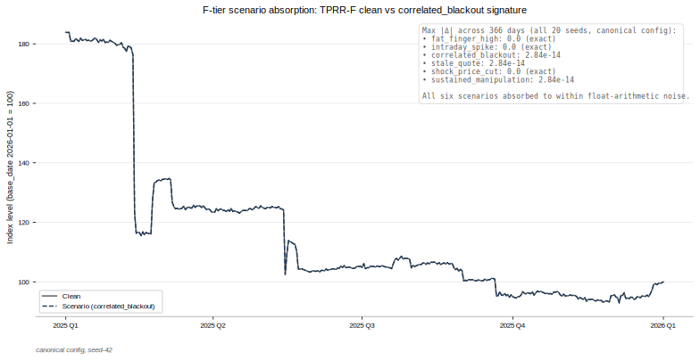
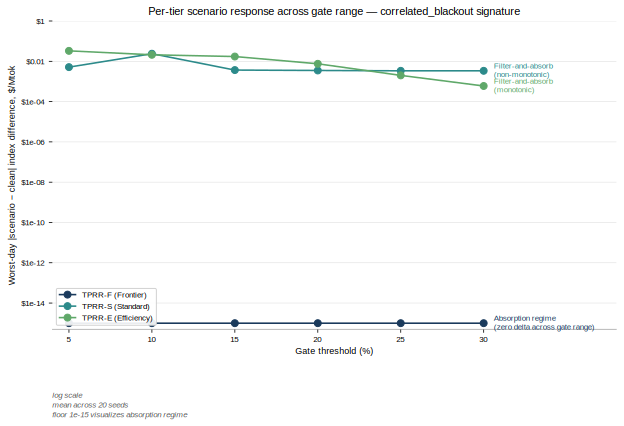
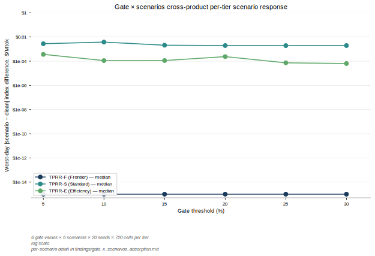

# TPRR: A Three-Tier Benchmark for AI Inference Token Prices

**Methodology, Empirical Validation, and Comparative Positioning**

Noble Markets

**Effective date**: 2026-05-08

---

## 1. Introduction

### 1.1 The AI inference benchmarking gap

AI inference has emerged over the past several years as a material enterprise operating expense for organizations operating production-scale AI workloads. Per-enterprise spend at the upper end now reaches operationally significant scale, with aggregate market expenditure approaching the budget weight of established mid-tier procurement categories.

This growth has outpaced the financial infrastructure that surrounds other operationally significant cost categories. Cloud compute spend is increasingly procured under reserved-capacity contracts anchored to published list prices; energy procurement is hedged against published commodity benchmarks; foreign-exchange exposure is hedged against published reference rates. AI inference token pricing has none of this supporting infrastructure: no benchmark, no derivative instruments, no risk-transfer framework, and no objective basis for cross-provider performance attribution.

The absence of benchmarks is not unique to AI inference at this stage of its market development. Most operationally significant cost categories have passed through earlier eras of bilateral negotiation, opaque pricing, and the absence of standardized reference rates before benchmarks emerged. The reform-era literature on financial benchmarks documents both why benchmarks come to exist for asset classes that reach a critical mass of enterprise exposure and why their construction matters for market integrity (Duffie and Stein, 2015). The case for an AI inference benchmark rests on these structural arguments applied to a new asset class.

### 1.2 What TPRR is

The Token Price Reference Rate (TPRR) is a three-tier benchmark family for AI inference output-token prices, denominated in United States dollars per million tokens. The benchmark family consists of three core indices covering distinct segments of the AI inference market: TPRR-F (Frontier) for top-capability models at approximately ten dollars per million output tokens and above; TPRR-S (Standard) for mid-tier workhorse models at approximately one to ten dollars per million output tokens; and TPRR-E (Efficiency) for economy-tier models below one dollar per million output tokens. These approximate price bands are illustrative; tier classification is determined by Index Committee review against the eligibility criteria specified in §3.2.

The benchmark is constructed by daily time-weighted average price (TWAP) fixing applied to constituent output-token prices, with constituents aggregated through a dual-weighted formula that combines volume-attestation weights from a three-tier confidence hierarchy with exponential median-distance weights. Two derived analytical series accompany the core benchmark family: the Frontier Premium Ratio (TPRR-F divided by TPRR-S) and the Standard Efficiency Ratio (TPRR-S divided by TPRR-E). A blended-input series, TPRR-B, applies a fixed input-output blend ratio to constituent prices and serves as an analytical complement; this series is informational only and is not intended for derivative settlement.

The current paper presents the canonical methodology specification, version 1.3, as the reference state for empirical validation. The benchmark family is rebased to an index level of 100 at the base date 2026-01-01.

### 1.3 Contributions

This paper makes three principal contributions to the literature on benchmark construction for emerging asset classes.

The first contribution is a methodology design with an explicit six-control manipulation-resistance framework. The controls operate at distinct layers of the index construction pipeline: a time-weighted average price daily fix neutralizes single-observation manipulation attempts; a slot-level data quality gate filters extreme deviations from a trailing baseline; independent transaction cross-validation tests posted prices against an independent transaction-aggregator data source; a minimum constituent count establishes a redundancy floor below which a tier suspends rather than publishes a degraded fix; provider self-reported volumes are excluded from the weighting formula entirely; and exponential median-distance weighting damps the influence of constituents that depart from the active set's median price.

The second contribution is empirical validation of the methodology under a six-scenario stress suite spanning a 366-day backtest on a synthetic but realistically-calibrated panel. The validation establishes an F-tier absorption regime (zero scenario delta across all six tested scenarios at machine precision), a filter-and-absorb regime with monotonic gate-dependence on the E-tier, and a filter-and-absorb regime with non-monotonic gate-dependence on the S-tier. The regime distinction correlates with constituent count multiplied by contributor depth per constituent, suggesting that the redundancy reservoir size is the structural property that determines per-tier manipulation-resistance posture.

The third contribution positions the methodology within the institutional benchmark governance framework articulated in the IOSCO Principles for Financial Benchmarks (IOSCO, 2013) and the academic literature on robust benchmark design under data-constrained environments (Duffie and Dworczak, 2021). The benchmark architecture combines a three-tier volume-attestation hierarchy with continuous blending across tiers, within-tier-share normalization, tier-eligibility thresholding, and an inverted tier-ordering convention (Tier A > Tier C > Tier B) reflecting bias-chain length rather than volume-attestation seniority, addressing failure modes that arise under thin tier coverage. The validation backtest surfaces a standalone empirical observation: differential decline rates across tiers (approximately 73 percent decline on TPRR-E, 49 percent on TPRR-S, and 42 percent on TPRR-F over the 2025-Q1 to base-date interval) suggest tier-differentiated commoditization dynamics that motivate the segmented benchmark structure.

### 1.4 Paper structure

The remainder of the paper proceeds as follows. Section 2 establishes the market context: the structure of AI inference pricing, the precedent for benchmark formation in other asset classes that passed through analogous early-market eras, and the design challenge specific to a benchmark constructed without an established transactional infrastructure. Section 3 presents the methodology in full, including constituent eligibility, the volume-attestation hierarchy, the exponential median-distance weighting formula, the TWAP daily fix convention, and the six-control manipulation-resistance framework. Section 4 reports empirical validation results from a 366-day backtest on a synthetic constituent panel under a six-scenario stress suite, with multi-seed cross-validation establishing per-tier response regimes. Section 5 discusses limitations, comparative positioning relative to existing commodity benchmarks, and future research directions. Section 6 provides references.

---

## 2. Market context

### 2.1 The AI inference cost structure

AI inference pricing is structured at the granular level of input and output tokens. Providers post per-million-token prices for both directions, with output tokens typically priced higher than input tokens because of the cost asymmetry of autoregressive generation and the workload patterns under which output dominates the value delivered to the enterprise consumer. Per-million-token prices vary substantially across providers, across model versions within a provider, and across deployment tiers (regional, on-demand, reserved capacity, enterprise contract).

The pricing landscape is unilateral. Each provider publishes its own pricing page, modifies prices without prior notice, and applies discounts or surcharges through bilateral enterprise agreements that are not publicly disclosed. There is no analogue to the panel-submission structure that underpinned the London Interbank Offered Rate, or to the physical-cargo broker-mediated market structure that underpins the Brent crude oil benchmark. The absence of established transactional infrastructure means that constructing a benchmark in this environment cannot rely on aggregating broker quotes or transactional executions in the standard commodity-benchmark pattern.

A second structural feature is the granularity of provider price discrimination. The same provider often offers the same underlying model at materially different prices depending on deployment context (standard model variant versus reasoning-extended variant; on-demand versus reserved throughput); a benchmark aggregating across providers must normalize across this within-provider variation before comparing across providers. Versioned endpoints introduce additional complexity: a single named model family typically has multiple versioned releases active simultaneously, each priced separately, with enterprise consumers switching between versions over time.

A third structural feature is the producer-of-record problem. No independent third party with broad audit credibility currently has a credible cross-provider view of AI inference token volumes. Providers self-report aggregate user counts and revenue figures in earnings disclosures, but self-reported volumes are not suitable for benchmark weighting because they create direct provider influence over the index calculation. Analyst firms triangulate cross-provider volume estimates, and transaction-aggregator services capture a subset of the market across many provider relationships. None of these data sources is sufficient as a sole basis for market-weighted indexation; a benchmark in this data environment must combine multiple data sources under a structured confidence hierarchy.

### 2.2 Benchmark precedent in other asset classes

The case for a benchmark in AI inference benefits from precedent in asset classes that underwent analogous early-market eras and developed benchmark infrastructure as the asset class scaled. Two precedents are particularly informative: the Brent crude oil benchmark in commodities and the Secured Overnight Financing Rate (SOFR) in fixed-income markets following London Interbank Offered Rate reform.

The Brent crude oil benchmark, published continuously since the early 1980s, emerged from a physical-cargo dated-cargo market in which broker-mediated transactions established the daily reference price. The methodology evolved over multiple decades from a simple physical-cargo basis to a more elaborate combination of dated cargoes, contracts for differences, and over-the-counter forward markets, with the methodology preserved against multiple manipulation attempts and reform episodes. The S&P Global Platts methodology guide for crude oil documents the contemporary form of the benchmark in detailed institutional reference (S&P Global Platts, 2023). For the purposes of the present paper, the Brent precedent demonstrates that benchmark methodology in a commodity context evolves through long cycles of refinement under operational pressure, and that the institutional architecture (methodology administrator, index committee, public reporting) is as important to benchmark integrity as the calculation itself.

The Secured Overnight Financing Rate, published by the Federal Reserve Bank of New York since 2018, was constructed in the aftermath of the LIBOR manipulation episodes of 2008 through 2012 and the subsequent regulatory effort to construct a replacement reference rate immune to the structural vulnerabilities that the manipulation episodes exposed (Duffie and Stein, 2015; Coulter, Shapiro, and Zimmerman, 2018; Federal Reserve Bank of New York, 2018; Alternative Reference Rates Committee, 2021). SOFR is transaction-based rather than quote-based, anchored in observable Treasury repurchase agreement transactions in deep markets, and accompanied by detailed governance documentation describing the construction, the manipulation-resistance posture, and the publication schedule. The SOFR design illustrates the contemporary best-practice expectations for a financial benchmark constructed under the institutional reform consensus: transactional basis where available, formal manipulation-resistance analysis, transparent governance, and an established institutional administrator with regulatory accountability.

The institutional governance dimension of benchmark design is codified in the Principles for Financial Benchmarks issued by the International Organization of Securities Commissions (IOSCO, 2013). The Principles establish nineteen substantive requirements covering benchmark quality, methodology quality, accountability framework, and integrity of the benchmark determination process.

The Brent and SOFR precedents establish the institutional template that a contemporary benchmark methodology is expected to satisfy: transparent calculation methodology, transactional anchoring where the data environment permits, explicit manipulation-resistance framework, formal governance institutions, and a credible IOSCO Principles compliance trajectory. The AI inference benchmark setting must satisfy these institutional expectations while acknowledging that the underlying data environment differs structurally from both the physical-commodity context and the deep-transaction-market context.

### 2.3 The AI inference benchmark challenge

The AI inference setting departs from both the Brent and SOFR precedents in ways that constrain benchmark design choices. No over-the-counter dealer-quote market exists; no broker-cleared transactional infrastructure exists; pricing transparency is provider-controlled list-price posting. The natural transactional basis that supports SOFR is unavailable, and the physical-cargo broker-mediated market underlying Brent has no analogue in AI inference.

The data-environment constraints relevant to benchmark methodology are threefold. First, posted prices are unilateral provider disclosures rather than transactional outcomes. A benchmark constructed from posted prices is structurally vulnerable to coordinated unilateral price changes by providers acting in concert, and a methodology in this setting must address the manipulation pattern that arises from unilateral price-posting power without the moderating effect of transactional verification. Second, volume data with cross-provider audit credibility does not exist at the present stage of market development. Constructing volume-weighted benchmarks requires acceptable proxies; the proxies that exist (analyst-triangulated revenue estimates, transaction-aggregator subsets, provider financial disclosures) all carry distinct bias profiles that the methodology must address explicitly through a confidence hierarchy. Third, market structure is still evolving rapidly: model versions are released and deprecated on monthly cadences, provider entry and exit at the segment level occurs at quarterly cadences, and pricing discrimination strategies are actively explored.

The robust-benchmark-design literature provides conceptual guidance for benchmark construction under these constraints (Duffie and Dworczak, 2021). The general principle from that literature is that benchmark designs should be robust to the specific manipulation patterns enabled by the available data environment, and that the manipulation-resistance posture should be evaluated explicitly rather than assumed. For an AI inference benchmark, the robust-design framework implies that the manipulation patterns relevant to unilateral price-posting power (coordinated unilateral changes, single-provider strategic price changes, manipulation of volume proxies, and manipulation of within-tier price-share signals) require explicit treatment in the methodology.

The IOSCO Principles framework (IOSCO, 2013) guides the institutional expectations applied to a benchmark in the formation stage. While the Principles assume a more mature transactional infrastructure than the AI inference market currently supports, the methodology-quality and integrity-of-determination requirements are independent of the underlying transactional architecture and apply equally to a benchmark constructed from posted prices in a still-forming market. A benchmark methodology that documents the manipulation-resistance posture explicitly, publishes the calculation methodology transparently, and establishes institutional governance trajectories appropriate to the formation stage of the underlying market can be defended within the IOSCO framework even in advance of the establishment of a mature transactional market.

### 2.4 Tier-differentiated commoditization observation

A standalone empirical observation from the validation backtest motivates the three-tier semantic structure of the TPRR benchmark family. Over the 366-day backtest interval from 2025-Q1 to the base date (2026-01-01), the median index level at the start of the interval, rebased so that the base-date level equals 100, was approximately 365 for TPRR-E, 196 for TPRR-S, and 172 for TPRR-F. The implied decline rates over the interval are approximately 73 percent for TPRR-E, 49 percent for TPRR-S, and 42 percent for TPRR-F.

The differential pattern is not an artifact of the rebasing convention. Rebasing scales all three indices to coincide at the base-date level by construction, but the proportional change between any two dates on the trajectory reflects the underlying price ratio between those dates in dollars per million tokens, which is invariant to the rebasing convention. The differential pattern is also not driven by a single constituent: the medians are computed across 20 simulation seeds in the synthetic-panel validation backtest, and the cross-seed dispersion at each date is well-bounded by the 5th-95th percentile band in the supporting empirical evidence.

The pattern is consistent with tier-differentiated commoditization. The efficiency-tier (TPRR-E) consists of constituents that are increasingly subject to per-token price pressure as the commoditization process associated with the efficiency-tier segment proceeds, while the frontier-tier (TPRR-F) consists of constituents whose capability differentiation remains a barrier to commoditization pressure. The standard-tier (TPRR-S) occupies an intermediate position. The standalone observation does not establish causation, but it does suggest that the three tiers respond to materially different market-structural dynamics, which is the rationale for maintaining separate benchmark series at the three tiers rather than aggregating them into a single market-wide index.

---

## 3. Methodology

### 3.1 Index architecture overview

The TPRR benchmark family consists of three core indices and three derived analytical series. The three core indices (TPRR-F, TPRR-S, TPRR-E) cover the frontier, standard, and efficiency segments of the AI inference market and are constructed identically: a daily fix on each tier's constituent set, calculated through a dual-weighted formula that combines volume-attestation weights from a three-tier confidence hierarchy with exponential median-distance weights. The fix is denominated in United States dollars per million output tokens.

For index tier T in {F, S, E} on fixing date d, the dual-weighted aggregation across the tier's constituents is:

**TPRR_T(d) = Σ_i [ w_vol_i × w_exp_i × P̃_i(d) ] / Σ_i [ w_vol_i × w_exp_i ]**

where the sum runs over constituents i in tier T, w_vol_i is the constituent's volume-attestation weight (§3.4), w_exp_i is the exponential median-distance weight (§3.5), and P̃_i(d) is the constituent's daily blended price (§3.4 and §3.6).

Two analytical ratio series are derived from the core indices. The Frontier Premium Ratio (FPR) is calculated as TPRR-F divided by TPRR-S; the Standard Efficiency Ratio (SER) is TPRR-S divided by TPRR-E. The ratios provide cross-tier analytical signal on the evolution of relative pricing within the AI inference market.

A third derived series, TPRR-B, applies a fixed input-output blend ratio (0.75 output, 0.25 input) to the constituent prices and aggregates through the same dual-weighted formula. The blend ratio reflects observed average token consumption proportions in enterprise inference workloads. TPRR-B is published as an informational analytical complement to the core series and is not intended for derivative settlement. Workload-specific blend ratios may be published as supplementary series as observed consumption data matures. All core indices and TPRR-B are rebased to an index level of 100 at the base date 2026-01-01; the base-date rebasing is a presentational convention, with the underlying calculation in dollars per million tokens remaining the canonical reference for derivative settlement on the core indices.

### 3.2 Constituent eligibility and tier classification

Constituents in the TPRR universe are AI inference model endpoints offered by commercial providers that meet five eligibility criteria. The first criterion is commercial availability: the model must be accessible via a publicly documented application programming interface with programmatic access; internal research-preview models are excluded. The second criterion is pricing transparency: the provider must publish explicit per-token pricing in United States dollars per million tokens, for both input and output directions, on a publicly accessible pricing page. The third criterion is enterprise adoption: the model must demonstrate material enterprise production usage, evidenced by disclosed customer counts, third-party usage attestation, or contributor data from the methodology administrator's contributor panel. The fourth criterion is operational stability: the provider must demonstrate continuous application programming interface availability of at least 99.5 percent over the preceding 90 days. The fifth criterion is version governance: the provider must maintain stable versioned model endpoints; models subject to silent capability updates without version increments are ineligible.

Eligible constituents are classified into one of the three index tiers (F, S, E) by Index Committee review. Tier classification reflects two correlated dimensions: capability profile (where the model sits in the spectrum of state-of-the-art reasoning, multimodal, and long-context capabilities) and pricing profile (output token price band). The capability and pricing profiles are correlated by economic construction, since capability differentiation supports pricing power and pricing pressure forces capability-tier reassessment as the market evolves. Tier classification is determined by the Index Committee based on both profiles jointly rather than mechanically by pricing alone.

The pricing bands referenced in §1.2 are illustrative ranges drawn from the reference constituent registry rather than threshold-enforced boundaries. A constituent whose price drifts across a band boundary remains in its assigned tier until the Index Committee reviews and reclassifies. Tier classification is reviewed quarterly under the Index Committee's standing constituent review process; constituents whose capability or pricing profile materially shifts may be reclassified at any quarterly review.

### 3.3 Output token price as the benchmark basis

The TPRR core indices are constructed from output token prices only, with input token prices excluded from the core calculation. The rationale rests on three structural arguments specific to AI inference economics.

First, output tokens are the binding cost variable for enterprise inference workloads. Generating each output token requires a complete forward pass through the model, which is the compute-intensive operation that determines marginal infrastructure cost; this is the cost that scales directly with enterprise workload volume and is largely outside the enterprise's operational control. Input token costs, by contrast, are functions of prompt engineering discipline, context management policies, and other operational levers within the enterprise's direct control. A benchmark intended to support derivative hedging of enterprise inference cost must measure the cost component that the enterprise cannot operationally reduce.

Second, mixing input token costs into a settlement benchmark introduces basis risk between the hedge and the underlying exposure. Input token consumption per enterprise unit of output (per query response, per agentic task completion, per code synthesis) varies materially across workload designs, and a single fixed input-output blend ratio cannot accurately reflect the heterogeneity of enterprise workload composition. A blend-based benchmark would be ill-suited to settlement on contracts hedging workloads with input-to-output ratios materially different from the blend assumption.

Third, output token pricing is the more transparent quantity in provider disclosure practice. Output prices are published as primary headline numbers in provider pricing pages, while input prices are sometimes presented in less prominent positions or with greater pricing-tier complexity. Anchoring the core benchmark to the more transparent quantity supports the integrity-of-determination requirement in the IOSCO Principles framework (IOSCO, 2013).

The blended analytical series TPRR-B is published as an informational complement that aggregates both input and output prices under a fixed blend ratio. TPRR-B serves analytical purposes such as tracking total token cost evolution under representative workload composition but does not replace the core series for derivative settlement.

### 3.4 Volume attestation hierarchy

The volume-attestation hierarchy is the methodology's structural response to the producer-of-record problem described in §2.1. No single data source for AI inference token volumes carries credible cross-provider audit standing at the present stage of market development. The methodology therefore combines three data sources with distinct bias profiles through a confidence hierarchy designed to triangulate volume signal across sources rather than rely on a single putative ground truth.

The three tiers are: Tier A (contributor-attested), Tier B (revenue-derived proxy), and Tier C (transaction-verified market proxy). Tier A data is sourced from direct application programming interface integrations with contributor billing systems, providing provider-attested billing data that matches the contributor's invoice. Tier B data is derived from publicly disclosed provider revenue figures (quarterly and annual reports, supplemented by third-party analyst estimates), with provider-level revenue allocated across model endpoints using disclosed product mix and market-share data. Tier C data is sourced from transaction-aggregator services that publish transaction-derived model usage data filtered to exclude free-tier and non-enterprise-relevant usage.

Each tier carries a confidence haircut applied in the aggregation formula. The haircut values are Tier A at 1.00, Tier C at 0.80, and Tier B at 0.50. The haircut ordering A > C > B is intentionally inverted relative to a volume-attestation seniority ranking that would place Tier B above Tier C on the strength of its direct provider basis. The methodology reverses this ordering because the haircut reflects bias-chain length rather than volume-attestation seniority: Tier C is direct third-party measurement (single-step bias from transaction-aggregator user-base composition); Tier B is multi-step bias through the revenue-allocation chain (provider revenue, then API share within provider revenue, then within-provider model split). The accumulated multi-step bias warrants a heavier haircut on Tier B than on Tier C even though Tier B carries a wider provider scope. The methodology preserves Tier B in the hierarchy rather than redirecting it to Tier C because future improvements in provider transparency, including tier-level token disclosures becoming standard in public-company financial reporting, will shorten Tier B's bias chain considerably; at that point Tier B will provide a superior signal than Tier C.

The methodology aggregates across tiers through continuous blending rather than priority fall-through. For each constituent on each fixing date, contributions from all tiers in which the constituent has data, expressed as within-tier shares per the normalization mechanism described below, are blended with coefficients (0.6 for Tier A, 0.3 for Tier C, 0.1 for Tier B) and redistributed proportionally when a tier has no data for the constituent on the date. Continuous blending across all available tiers, rather than single-tier selection per constituent per day, produces smooth transitions across tier-coverage changes; cross-tier magnitude differences between panel-sum volumes and revenue-derived volumes would otherwise create cliff-edge dynamics if a constituent's selected tier shifted abruptly as contributor counts crossed coverage thresholds.

Two normalization mechanisms make continuous blending dimensionally consistent. Within-tier-share normalization re-expresses each constituent's volume in a given tier as a fraction of the tier's total volume, removing the magnitude gap between panel-sum and revenue-derived volume scales. The normalization is essential: without it, the larger-magnitude tier would dominate the blending sum regardless of haircut application. The tier-eligibility threshold dormants a tier for an index segment when fewer than three constituents have valid data in that tier on the fixing date; the dormant tier contributes nothing to the blending sum and its coefficient redistributes proportionally to active tiers. The threshold extends the minimum-three epistemic principle from the contributor-to-constituent layer to the constituent-to-attestation-tier layer, on the principle that at every aggregation step combining independent observations, a minimum of three observations is required (Duffie and Dworczak, 2021).

The architecture reflects the IOSCO Principles framework requirement that benchmark methodologies should address the integrity of the benchmark determination process through transparent, documented confidence weighting across constituent data sources (IOSCO, 2013).

### 3.5 Exponential median-distance weighting

The methodology applies an exponential median-distance weighting to each constituent's contribution to its index tier. Given the blended price P̃_i for constituent i in index tier T on fixing date d, and the median price P̃_median across the index tier's active constituent set on the same date, the exponential weight is:

**w_exp_i = exp( –λ × | P̃_i – P̃_median | / P̃_median )**

with the decay parameter λ set to 3 in the canonical methodology. The exponential weight is centered at 1.0 when the constituent's price coincides with the tier median and decays smoothly with relative distance from the median. At representative distances, the weight is 0.861 at 5 percent from median, 0.741 at 10 percent, 0.549 at 20 percent, 0.223 at 50 percent, and 0.050 at 100 percent.

The exponential mechanism is preferred over hard-threshold exclusion (such as a trimmed mean or Winsorized mean) for two reasons. First, the exponential weight is continuous rather than binary: there is no cliff edge at which a constituent is suddenly included or excluded. This eliminates a manipulation vector in which a participant positions a constituent price just inside a hard threshold. Second, the weight is self-calibrating: as the index tier's constituent set evolves and the median shifts, each constituent's weight adjusts automatically without requiring a methodology revision.

The exponential weight multiplies against the volume weight in the dual-weighted formula, producing a benchmark that requires a constituent to be both materially weighted by volume and competitively priced to materially influence the index. The mechanism contrasts with the cardinal mechanism proposed in the contemporary literature on LIBOR replacement design, which addresses a different structural problem (panel manipulation under quote submission) and operates through a different incentive mechanism (Coulter, Shapiro, and Zimmerman, 2018). The cardinal mechanism uses transaction-anchored prior beliefs to penalize submitters whose quotes deviate from realized transaction prices, addressing the LIBOR-specific structural problem in which submitters were asked to report unobservable counterfactual borrowing rates. The exponential median-distance mechanism in TPRR addresses a different structural problem: outlier positioning under unilateral price-posting power, where the manipulation vector is not misreporting but strategic placement of an actual posted price.

### 3.6 Time-weighted average price daily fix

The TPRR daily fix is constructed by time-weighted average price aggregation across the 09:00–17:00 UTC fixing window. The window is partitioned into 32 fifteen-minute slots, zero-indexed from 0 through 31; the slot prices for each (contributor, constituent, date) triple are reconstructed from the day's posted price and any recorded intraday price-change events for that triple. On a day with no change event, all 32 slots equal the posted price and the daily TWAP equals the posted price. On a day with a price change at slot index S, slots [0, S) carry the pre-change price and slots [S, 32) carry the post-change price, with the daily TWAP slot-weighted accordingly. Multiple change events on a single day are ordered by slot index and applied sequentially.

The TWAP daily fix is the methodology's primary first-line manipulation-resistance mechanism. A participant seeking to influence the daily fix would need to sustain a manipulated price continuously across the eight-hour fixing window, which represents real cost in revenue foregone on actual transactions executed at the manipulated price. Point-in-time window-dressing, the primary mechanism exploited in the LIBOR manipulation episodes (Duffie and Stein, 2015), is structurally precluded by this design.

The methodology uses TWAP-then-weight ordering: for each (contributor, constituent, fixing date), the daily TWAP is computed first, then the dual-weighted aggregation across constituents in the index tier consumes each constituent's daily TWAP as the per-constituent price input. The TWAP-then-weight ordering matches the dominant convention across established commodity and reference-rate benchmarks (S&P Global Platts, 2023; SOFR Academy, 2023; Federal Reserve Bank of New York, 2020). The alternative weight-then-TWAP ordering would compute the dual-weighted aggregation slot-by-slot and then average across the 32 aggregated slot levels; empirical validation in §4 establishes that the two orderings produce results equivalent to machine precision on the synthetic-panel backtest.

Slot-level data quality gating is applied per slot per (contributor, constituent, date) triple; slots that fail the gate are excluded from the daily TWAP, with the daily TWAP equal to the arithmetic mean of the surviving slot prices. If all 32 slots fail the gate for a given (contributor, constituent, date) triple, the triple has no valid daily TWAP and the constituent's daily aggregation drops the contributor's contribution for that date. The slot-level gate is detailed in §3.7 as part of the manipulation-resistance framework.

### 3.7 Manipulation-resistance framework

The manipulation-resistance posture of the TPRR methodology is structured around the trigger/target/nexus framework that organizes the contemporary academic literature on market manipulation (Ledgerwood and Carpenter, 2012). Under that framework, a manipulation scheme requires three elements to be successful: a trigger (the action the manipulator takes), a target (the price or quantity the action is intended to affect), and a nexus (the mechanism through which the trigger produces the target effect). A manipulation-resistant benchmark design disrupts at least one of the three elements, ideally multiple. The six controls in the TPRR methodology are presented below with explicit reference to the framework component each control most directly disrupts.

The first control is the TWAP daily fix (§3.6), disrupting the trigger by requiring sustained manipulated pricing across the eight-hour fixing window at real revenue cost. Point-in-time manipulation, the trigger pattern exploited in the LIBOR episodes, is structurally precluded (Hernando-Veciana and Tröge, 2020).

The second control is the slot-level data quality gate, comparing each fifteen-minute slot price to the constituent's trailing five-day average and excluding slots deviating by more than 15 percent. Three consecutive days with at least one gate firing suspends the affected (contributor, constituent) pair from index calculation; ten consecutive clean days reinstate the pair. The asymmetric thresholds prevent oscillation at the threshold boundary. The gate addresses both data-quality contamination and trigger feasibility for extreme-departure manipulation strategies (Ko, Kozhanov, and Wilkoff, 2016).

The third control is independent transaction cross-validation. Independent transaction probes against constituent endpoints during the fixing window test whether posted prices correspond to prices actually charged on observable transactions; a discrepancy exceeding 2 percent quarantines the price observation pending review and substitutes the prior validated price for the daily fix. The control disrupts the nexus through which a posted-price manipulator would transmit a fictitious price to the index calculation: without cross-validation, the manipulator could sustain a posted price disconnected from real transactional behavior, but cross-validation makes the disconnect detectable.

The fourth control is the minimum constituent count requirement: each index tier requires at least three active constituents (constituents with valid daily TWAPs) for a daily fix to publish. Below the threshold, the tier suspends rather than publishes a degraded fix, with the prior valid fix carried forward. The control disrupts the trigger for strategies that depend on concentrated influence over the constituent set, since a manipulator would need to control or coordinate across at least three independent constituents to influence the published fix.

The fifth control excludes provider self-reported volumes from the weighting formula entirely. Self-reported volumes would create direct provider influence over the index calculation and a structural manipulation vector: a provider could over-report volumes for high-priced constituents and under-report for low-priced ones to influence the volume-weighted aggregation. The exclusion disrupts the target by removing the most direct provider-controlled lever from the calculation (Kyle and Viswanathan, 2008). Excluding self-reported volumes entirely, rather than conditioning their acceptance on attestation, removes the vector by construction rather than mitigating it through institutional review.

The sixth control is exponential median-distance weighting (§3.5), damping the influence of constituents that depart from the active set's median price. The mechanism disrupts the nexus for outlier-positioning manipulation: the manipulator can still execute the trigger (moving a constituent's price away from the median), but the exponential weight progressively weakens the mechanism through which that price movement translates into index influence. The continuous, self-calibrating form of the weight eliminates the binary cliff-edge vulnerability of hard-threshold designs (Allen and Gale, 1992; Coulter, Shapiro, and Zimmerman, 2018).

---

## 4. Empirical validation

### 4.1 Validation approach

The TPRR methodology was tested across a series of sensitivity sweeps on a 366-day backtest running from 2025-01-01 to the base date 2026-01-01. The validation panel comprises sixteen reference constituents distributed across the three index tiers, with a Tier A panel of ten contributors (each covering between four and all sixteen constituents, with every constituent covered by at least five contributors), revenue-derived volume estimates on the Tier B layer for the in-scope public providers, and a transaction-aggregator snapshot covering the in-scope subset of constituents on the Tier C layer. The panel is synthetic and deterministic by random seed, calibrated against plausible 2025 enterprise-segment prices and contributor-volume distributions.

The sweep program is organized into four cross-products that together characterize the methodology's behavior across the primary parameter axes:

- A single-seed downstream-parameter cross-product testing the decay parameter λ ∈ {1, 2, 3, 5, 10}, Tier B confidence haircut ∈ {0.4, 0.5, 0.6, 0.7}, blending coefficients, and suspension and reinstatement thresholds.
- A single-seed gate-threshold cross-product testing gate ∈ {5%, 10%, 15%, 20%, 25%, 30%} and TWAP ordering, with each sweep against the clean panel and the six manipulation scenarios.
- A multi-seed downstream-parameter cross-product covering three methodology design points (loose, default, tight) × 20 seeds × {clean panel, six scenarios}, totaling 420 panel runs.
- A multi-seed gate × scenarios cross-product covering six gate values × 20 seeds × {clean panel, six scenarios}, totaling 840 panel runs.

The six manipulation scenarios are: fat_finger_high (a single large price spike from a single contributor); intraday_spike (a multi-slot perturbation across a single fixing day); correlated_blackout (coordinated suspension of multiple contributor signals across a multi-day window); stale_quote (a multi-day period in which a contributor's posted price remains unchanged while market consensus drifts away from it); shock_price_cut (a sudden permanent price-level shift on a single constituent); and sustained_manipulation (a multi-day directional perturbation across multiple contributors). The scenarios are designed to test the gate-and-suspension manipulation-resistance mechanisms specifically; the limitation of testing against a scenario suite authored alongside the methodology is acknowledged in §4.4.

### 4.2 Methodology-level findings

The headline empirical result is a complete scenario absorption finding on TPRR-F: across the combined downstream-parameter cross-product (131,760 TPRR-F daily datapoints) and the gate × scenarios cross-product (263,520 TPRR-F daily datapoints), every observation is byte-identical to the corresponding clean-panel value, with maximum absolute trajectory delta of 2.84 × 10⁻¹⁴ at machine-precision noise floor. The cumulative 395,280 TPRR-F datapoints across the two cross-products establish that the F-tier absorption regime holds across both the upstream parameter axis (the gate threshold) and the downstream parameter axis (the continuous-blending design space).

The same cross-products produce trajectory variation on TPRR-S and TPRR-E under specific scenarios, with per-tier response signatures that correlate with redundancy reservoir size, the product of constituent count and contributor depth per constituent. Three regimes emerge from the data.

The F-tier (six constituents, three or more contributors per constituent at the canonical configuration) sits in the **absorption regime**. The redundancy reservoir is large enough that the upstream-filtering layer of the methodology (slot-level data quality gate, suspension and reinstatement policy, minimum-three-constituents threshold) filters scenario perturbations completely before they reach the aggregation step. The dual-weighted formula's averaging across the surviving constituent set produces zero scenario delta at every gate value tested. The same scenarios, the same gate values, the same zero result.

The E-tier (five to six constituents per panel realization, with the variation reflecting realization-dependent contributor coverage on the Tier A layer) sits in the **filter-and-absorb regime with monotonic gate-dependence**. The smaller redundancy reservoir admits trajectory variation under three of the six scenarios (correlated_blackout, shock_price_cut, stale_quote), with response magnitude monotonically damping as the gate loosens. The scenario set producing variation is gate-invariant; only the magnitude varies with the gate threshold. Across the swept gate range (gate thresholds from 5 percent to 30 percent) on the correlated_blackout signature scenario, the maximum absolute delta declines two orders of magnitude.

The S-tier (four constituents per panel realization) sits in the **filter-and-absorb regime with non-monotonic gate-dependence**. The smallest redundancy reservoir admits trajectory variation under four of the six scenarios, with the gate-dependence shape exhibiting non-monotonic swings across adjacent gate values. The mechanism for the non-monotonic pattern is small-constituent-count instability: strict gates suspend more S-tier constituents (the tier starts with only four), and moderate gates produce unstable interactions where suspension boundaries cross the minimum-three threshold non-monotonically across panel realizations.

The regime classification is structurally embedded in the relationship between constituent count, contributor depth per constituent, and the upstream-filter cascade. The F-tier's structural advantage rests on three properties that combine at the upstream layer: constituent redundancy in the index-tier population, contributor redundancy within each constituent's panel, and the slot-level data quality gate operating before the aggregation step. Scenario perturbations are filtered three times before reaching the dual-weighted formula, making the F-tier's absorption regime a structural consequence of the redundancy reservoir size rather than an artifact of any particular parameter choice.

A standalone empirical observation from the same backtest motivates the tier-differentiated commoditization framing in §2.4. The decline-rate calculation underlying that observation uses the median across the twenty simulation seeds at the canonical configuration: approximately 73 percent decline on TPRR-E, 49 percent on TPRR-S, and 42 percent on TPRR-F over the 2025-Q1 to base-date interval.

### 4.3 Parameter-space stability

Beyond the per-tier scenario response, the validation establishes four broader stability findings on the parameter space.

The first is **three-of-four downstream-parameter base-date invariance**. The parameter cross-product tests suspension threshold ∈ {2, 3, 5, 7}, reinstatement threshold ∈ {5, 10, 15, 20}, gate threshold ∈ {5%, 10%, 15%, 20%, 25%, 30%}, and TWAP ordering ∈ {TWAP-then-weight, weight-then-TWAP}. Three of the four parameters leave the TPRR-F base-date raw value invariant within their swept ranges: suspension and reinstatement thresholds produce identical base-date levels across all tested values, and TWAP ordering produces a base-date difference at the fourth decimal place. The gate threshold is the exception: base-date levels shift downward at strict settings (5 percent: $28.10/Mtok; 10 percent: $29.52/Mtok) and converge at and above the canonical 15 percent setting ($30.11/Mtok at 15, 20, 25, and 30 percent). The canonical 15 percent gate sits exactly at the convergence edge.

The second is **gate threshold as the most consequential parameter**. The gate is the only parameter that shifts the published level at strict settings and produces the highest intermediate-day trajectory leverage (88 percent of TPRR-E days differ between gate=5% and gate=30%). The combination places the gate structurally upstream of every other parameter: the gate filter determines which slot-level prices the methodology consumes before any downstream parameter operates on them.

The third is **λ calibration trade-off between manipulation resistance and effective constituent breadth**. Across the swept λ ∈ {2, 3, 5} design space, TPRR-F annualized realized volatility increases monotonically with λ: 24.8 percent at λ=2, 27.7 percent at λ=3, and 32.0 percent at λ=5. The pattern reflects a structural trade-off in median-distance weighting: at low λ the weighting is gentle and aggregation averages across a broad constituent set, producing smoother index trajectories at the cost of weaker outlier damping; at high λ the weighting concentrates on the few constituents nearest the median, producing stronger outlier damping at the cost of allowing idiosyncratic moves of near-median constituents to pass through. The canonical λ=3 choice balances these effects, accepting modestly elevated realized volatility relative to the loose setting in exchange for the manipulation-resistance properties documented in §3.5 and §3.7.

The fourth is **TWAP-then-weight versus weight-then-TWAP empirical equivalence**. The two orderings produce a base-date difference of approximately one ten-thousandth of a dollar per million tokens on TPRR-F, with 80 percent of days producing identical output. Divergence occurs only when gate-induced slot exclusions break the within-day uniformity of weights; the two formulations are algebraically identical under uniform weights. The TWAP-then-weight choice aligns the methodology with the dominant convention across established commodity benchmarks; the empirical equivalence finding establishes that this alignment imposes no informational cost on the reference validation panel.

### 4.4 Scope and limitations

The empirical validation is bounded by four scope limitations that constrain the strength of the conclusions and identify the priorities for further validation work.

The first limitation is the synthetic-panel basis. The validation panel is calibrated against plausible 2025 enterprise-segment prices and contributor-volume distributions, with deterministic generation by random seed. Real provider price history may produce tighter cross-seed dispersion than the synthetic panel; conventional commodity benchmarks (Brent over a one-year window) typically run at 2 to 3 percent daily volatility, while the synthetic panel runs at approximately 6.7 percent standard deviation at the default configuration. Real-data validation against contributor billing data is a priority for the methodology evolution path.

The second limitation is the scenario-suite calibration. The six scenarios were authored alongside the methodology with the gate-and-suspension manipulation-resistance mechanisms in mind; they target perturbation patterns the gate is designed to catch. The byte-identical F-tier absorption result is consistent with the methodology being well-tuned to the scenarios it was designed to absorb. The result does not demonstrate absorption against compromised-contributor scenarios with sub-gate price drift, simultaneous multi-tier coordinated attacks, slowly evolving manipulation cumulating below the gate threshold, volume-share manipulation operating on the within-tier-share normalization, or adversarial scenarios authored independently by a red-team review. These scenario classes are priorities for the next round of validation.

The third limitation is the Tier C coverage of the reference panel. Only one constituent has Tier C coverage in the current reference panel, leaving Tier C dormant for all three index tiers under the tier-eligibility threshold throughout the validation. The smooth-activation property of the tier-eligibility design ensures Tier C activates organically as coverage expands without methodology revision, but the empirical activation behavior is not characterized at the current state.

The fourth limitation is the absence of cross-product sweeps on five upstream parameter axes against scenarios: the minimum-three threshold, suspension and reinstatement policy, TWAP ordering with multi-seed extension, the tier-eligibility threshold, and adversarial scenarios beyond the six tested.

### 4.5 Reference visualization

The empirical findings reported in this section are supported by four figures.

*Figure 1: Per-tier TPRR index level across the 366-day backtest, canonical configuration. Centerline shows per-day median across 20 seeds; shaded band shows 5th-95th percentile across seeds. All three tiers rebased to index level 100 at the base date 2026-01-01. The differential decline rates across tiers (approximately 73 percent on TPRR-E, 49 percent on TPRR-S, and 42 percent on TPRR-F over the 2025-Q1 to base-date interval) motivate the tier-differentiated commoditization observation in §2.4 and §4.2.*

*Figure 2: TPRR-F clean panel versus correlated_blackout scenario panel, canonical configuration, seed-42 reference. The clean and scenario trajectories are indistinguishable at chart scale. The annotation block reports maximum absolute scenario delta across the twenty seeds for each of the six scenarios: three scenarios produce exact zero delta; three scenarios produce maximum delta at 2.84 × 10⁻¹⁴, within float-arithmetic noise.*

*Figure 3: Per-tier worst-day absolute scenario delta across the gate threshold range, for the correlated_blackout signature scenario, mean across twenty seeds. The three regimes are visually distinguishable: TPRR-F absorption (zero delta across the gate range, displayed at the log-floor of 1e-15), TPRR-S filter-and-absorb with non-monotonic gate-dependence, and TPRR-E filter-and-absorb with monotonic gate-dependence.*

*Figure 4: Per-tier median response across the gate × scenarios cross-product (six gate values × six scenarios × twenty seeds = 720 cells per tier), plotted against gate threshold on the x-axis. Per-scenario detail is available in supporting documentation.*

---

## 5. Discussion

### 5.1 Limitations and methodology evolution path

The TPRR methodology version presented in this paper represents a reference state for empirical validation; the methodology evolution path beyond this state addresses identified limitations and extends the validation scope to production-relevant data environments.

The most consequential limitation is the synthetic-panel basis of the empirical validation. The reference panel is calibrated against plausible 2025 enterprise-segment prices and contributor-volume distributions, with deterministic generation by random seed. Real provider price history is likely to produce tighter cross-seed dispersion than the synthetic panel reports, but the magnitude and direction of the convergence cannot be characterized without real-data validation. The methodology evolution path therefore prioritizes contributor onboarding and real-data validation against contributor billing data as the next round of validation work. The contributor-onboarding pathway also operationalizes the Tier A attestation layer, which currently lacks real-world coverage in the validation panel.

The second limitation is the scenario-suite calibration. The byte-identical F-tier absorption result is consistent with the methodology being well-tuned to the scenarios it was designed to absorb. Adversarial scenario authoring beyond the current suite, conducted by an independent red-team review, is a priority. The expanded scenario suite should explicitly include compromised-contributor scenarios with sub-gate price drift, simultaneous multi-tier coordinated attacks, slowly evolving manipulation cumulating below the gate threshold, and volume-share manipulation operating on the within-tier-share normalization rather than on price.

The third limitation is governance lifecycle institutionalization. The methodology specification documents the calculation, the manipulation-resistance posture, and the Index Committee constituent review process, but the institutional governance trajectory (regulatory engagement, methodology audit cycles, lifecycle-management infrastructure) is in formation. The IOSCO Principles framework anticipates these governance trajectories and the institutional expectations applied to administrators as benchmarks achieve material market significance (IOSCO, 2013).

The fourth limitation is the in-scope validation parameter axes. Five upstream parameter axes were not swept against scenarios in the present validation: the minimum-three threshold, suspension and reinstatement policy, TWAP ordering with multi-seed extension, the tier-eligibility threshold, and adversarial scenarios beyond the six tested. These cross-products are scoped for the next round of validation work.

### 5.2 Comparative positioning

The TPRR methodology incorporates design choices from established commodity-benchmark precedent while responding to data-environment constraints specific to the AI inference setting. Three categories of design choice illustrate the positioning.

The first category is design choices that follow established precedent. The TWAP daily fix across an eight-hour fixing window instantiates the broader convention of fixing-window-based daily aggregation that is standard across established commodity and reference-rate benchmarks (Federal Reserve Bank of New York, 2020; S&P Global Platts, 2023). The TWAP-then-weight ordering, in which each contributor's daily TWAP is computed before the dual-weighted aggregation across constituents, is the dominant convention across these benchmarks (S&P Global Platts, 2023; SOFR Academy, 2023). The manipulation-resistance design grounded in the trigger/target/nexus framework follows the contemporary academic literature on market manipulation (Ledgerwood and Carpenter, 2012). The institutional governance framework draws from the IOSCO Principles (IOSCO, 2013) and from the SOFR governance documentation that operationalized the Principles in a transactional-rate setting (Federal Reserve Bank of New York, 2018; Alternative Reference Rates Committee, 2021).

The second category is design choices that respond to the AI-inference-specific data environment. The three-tier volume-attestation hierarchy responds to the producer-of-record problem documented in §2.1: no single data source for AI inference token volumes carries credible cross-provider audit standing, and the hierarchy combines three data sources with distinct bias profiles through a confidence-weighted aggregation rather than relying on a single putative ground truth. The exponential median-distance weighting responds to the manipulation pattern that arises from unilateral price-posting power: outlier positioning is the principal manipulation vector under posted-price benchmarks, and the exponential weight progressively damps outlier influence without introducing the cliff-edge vulnerabilities of hard-threshold designs (Allen and Gale, 1992; Coulter, Shapiro, and Zimmerman, 2018). The continuous blending across attestation tiers, the within-tier-share normalization, and the tier-eligibility threshold collectively address the cliff-edge dynamics that arise when constituent or tier coverage crosses minimum thresholds (Duffie and Dworczak, 2021).

The third category is design choices specific to a benchmark in the formation stage of an emerging asset class. The three-tier semantic structure (TPRR-F, TPRR-S, TPRR-E) responds to the tier-differentiated commoditization dynamics surfaced in the validation backtest (§2.4, §4.2): different market-structural dynamics across the segments warrant separate benchmark series rather than aggregation into a single market-wide index. The structural choice acknowledges that the AI inference market is at an early formation stage where segment-level dynamics may diverge before the asset class reaches the maturity at which a single benchmark would carry comparable risk-transfer utility across the full market.

### 5.3 Future research directions

The empirical findings and methodology design choices in this paper open several research directions.

The tier-differentiated commoditization observation surfaced in §2.4 and §4.2 is the most natural avenue for further empirical research. The decline-rate pattern reported in the validation backtest suggests that the three market segments respond to materially different commoditization dynamics, but the dynamics themselves are not the subject of formal causal investigation in this paper. Future research could characterize the structural drivers of the differential pattern, the persistence of the pattern across longer time horizons, and the implications for derivative-product design that targets a specific tier rather than the aggregate market.

The cross-currency dimension is a second direction. The benchmark is denominated in United States dollars, which is the dominant invoicing currency for cross-border AI inference contracts at the time of writing. Enterprise consumers operating in other reporting currencies face additional foreign-exchange exposure in their AI inference budgets. Cross-currency benchmark variants and currency-hedged derivative-product designs are natural extensions that the present paper does not explore.

The adversarial-scenario research direction extends the manipulation-resistance characterization beyond the validated scenario suite. Independent red-team scenario authoring would test methodology absorption against attack vectors not anticipated in the design phase, and would provide a more credible basis for the absorption claims documented in §4.2.

The governance evolution direction follows the trajectory anticipated in the IOSCO Principles framework (IOSCO, 2013). As the benchmark achieves the institutional thresholds the Principles anticipate, the administrator's governance infrastructure is expected to evolve through stages comparable to those documented for established commodity and reference-rate benchmarks.

---

## 6. References

Allen, F., & Gale, D. (1992). Stock-price manipulation. *Review of Financial Studies*, 5(3), 503–529.

Alternative Reference Rates Committee. (2021). *An Updated User's Guide to SOFR.* Federal Reserve Bank of New York.

Coulter, B., Shapiro, J., & Zimmerman, P. (2018). A mechanism for LIBOR. *Review of Finance*, 22(2), 491–520.

Duffie, D., & Dworczak, P. (2021). Robust benchmark design. *Journal of Financial Economics*, 142(2), 775–802.

Duffie, D., & Stein, J. C. (2015). Reforming LIBOR and other financial market benchmarks. *Journal of Economic Perspectives*, 29(2), 191–212.

Federal Reserve Bank of New York. (2018). *Statement Introducing the Treasury Repo Reference Rates.* Operating Policy, April 2018.

Federal Reserve Bank of New York. (2020). *Statement Regarding the Publication of Compounded SOFR Averages and a SOFR Index.* Operating Policy, March 2020.

Hernando-Veciana, Á., & Tröge, M. (2020). Cheap talk and strategic rounding in LIBOR submissions. *Review of Financial Studies*, 33(6), 2585–2621.

International Organization of Securities Commissions. (2013). *Principles for Financial Benchmarks: Final Report.* IOSCO Report FR07/13.

Ko, K. J., Kozhanov, I., & Wilkoff, S. (2016). *Manipulation of Illiquid Asset Indexes.* Working Paper, U.S. Securities and Exchange Commission Division of Economic and Risk Analysis.

Kyle, A. S., & Viswanathan, S. (2008). How to define illegal price manipulation. *American Economic Review*, 98(2), 274–279.

Ledgerwood, S. D., & Carpenter, P. R. (2012). A framework for the analysis of market manipulation. *Review of Law & Economics*, 8(1), 253–295.

S&P Global Platts. (2023). *Methodology and Specifications Guide: Crude Oil.* S&P Global Platts, latest edition.

SOFR Academy. (2023). *AXI/FXI Across-the-Curve Credit Spread Indices: Construction and Methodology.* Working Paper.
